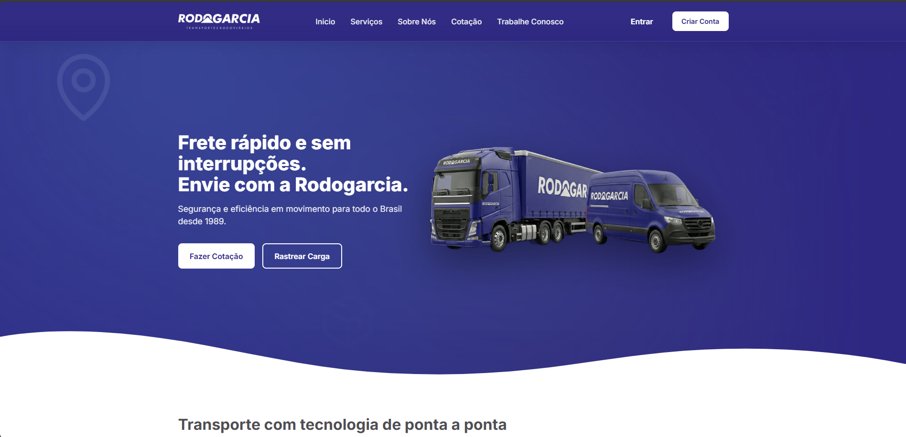

<!-- PORTFOLIO-FEATURED
title: Site Institucional Rodogarcia Transportes
description: Site institucional estatico focado em geracao de contatos, solicitacao de cotacao e reforco de marca, com SEO tecnico, performance e seguranca no deploy via Vercel.
technologies: HTML5, CSS3, JavaScript ES Modules, Node.js, Vercel
demo: https://site-rodogarcia.vercel.app/
highlight: true
image: public/imagem.png
-->

<p align="center">
  
</p>

# Site Rodogarcia Transportes

Site institucional estatico da Rodogarcia, pensado para converter visitas em contato comercial, cotacao e rastreio.

## Demo

- Producao: `https://site-rodogarcia.vercel.app/`
- Rastreio (externo): `https://rodogarcia.eslcloud.com.br/recipient_tracking`

## Navegacao publica

| Categoria | Item | URL amigavel | URL canonica |
| --- | --- | --- | --- |
| Institucional | Inicio | `/inicio` | `/` |
| Institucional | Quem somos | `/quem-somos` | `/sobre.html` |
| Institucional | Trabalhe Conosco | `/trabalhe-conosco` | `/trabalhe-conosco.html` |
| Institucional | Imprensa | `/imprensa` | `/imprensa.html` |
| Servicos | Servicos | `/servicos` | `/servicos.html` |
| Servicos | Nossos Servicos | `/nossos-servicos` | `/servicos.html` |
| Servicos | Solicitar Cotacao | `/solicitar-cotacao` | `/cotacao.html` |
| Servicos | Rastrear Encomenda | `/rastrear-encomenda` | externo |
| Servicos | Para empresas | `/para-empresas` | `/para-empresas.html` |
| Ajuda | Central de Ajuda | `/ajuda` | `/central-ajuda.html` |
| Ajuda | Fale Conosco | `/fale-conosco` | `/fale-conosco.html` |
| Ajuda | Termos de Uso | `/termos-de-uso` | `/termos-de-uso.html` |

Observacao: as rotas amigaveis e canonicas sao controladas por `vercel.json`.

## Stack

- HTML5
- CSS3 (base, layout, components, pages)
- JavaScript ES Modules
- Node.js (servidor local simples para desenvolvimento)
- Vercel (rewrites, redirects, headers e cache)

## Arquitetura do projeto

```text
site-rodogarcia/
|-- public/
|   |-- imagem.png
|   |-- manifest.json
|   `-- ...
|-- src/
|   |-- components/
|   |   |-- header.html
|   |   `-- footer.html
|   |-- css/
|   |   |-- base/
|   |   |-- components/
|   |   |-- layout/
|   |   `-- pages/
|   |-- script/
|   |   `-- mapas/
|   |-- index.html
|   |-- servicos.html
|   |-- sobre.html
|   |-- cotacao.html
|   |-- trabalhe-conosco.html
|   |-- imprensa.html
|   |-- para-empresas.html
|   |-- central-ajuda.html
|   |-- fale-conosco.html
|   `-- termos-de-uso.html
|-- robots.txt
|-- sitemap.xml
|-- vercel.json
|-- server.js
`-- package.json
```

## Executando localmente

Sem build step: o projeto e estatico.

### Opcao 1: servidor Node local

```bash
npm start
```

ou

```bash
node server.js
```

Acesse:
- `http://localhost:3000/src/index.html`

### Opcao 2: Vercel Dev (mais proximo de producao)

```bash
npx vercel dev
```

Acesse:
- `http://localhost:3000/` (ou a porta exibida no terminal)

## Qualidade tecnica aplicada

### SEO

- `title`, `meta description` e `canonical` por pagina
- Open Graph e Twitter Cards
- JSON-LD (Organization, LocalBusiness, Service, Breadcrumb e FAQ quando aplicavel)
- `robots.txt` e `sitemap.xml` na raiz

### Performance

- Imagens com atributos para reduzir CLS
- `preconnect` para origens criticas
- `defer` em scripts externos
- Cache configurado por tipo de asset no `vercel.json`

### Seguranca (headers)

- `Strict-Transport-Security`
- `Content-Security-Policy`
- `X-Frame-Options`
- `X-Content-Type-Options`
- `Referrer-Policy`
- `Permissions-Policy`

## Mapa interativo

Modulo em `src/script/mapas/`.

Arquivos principais:
- `src/script/mapas/config.js`
- `src/script/mapas/filiais.js`
- `src/script/mapas/mapeamento.js`
- `src/script/mapas/interacoes.js`
- `src/script/mapas/carregamento.js`
- `src/script/mapas/mapa.js`

Documentacao especifica:
- `src/script/mapas/README.md`

## Deploy

Deploy recomendado: Vercel.

Arquivos-chave:
- `vercel.json`
- `robots.txt`
- `sitemap.xml`

## Licenca

Uso interno do projeto Rodogarcia Transportes.
