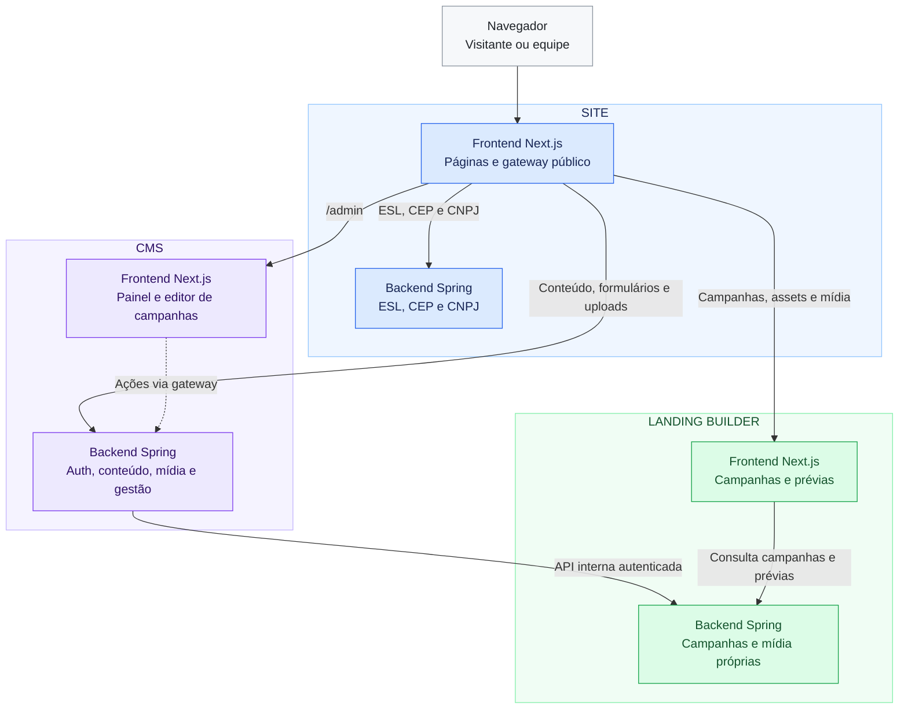

# Rodogarcia · Plataforma web

**Site institucional, gestão de conteúdo e campanhas — três aplicações, um monorepo.**

O visitante navega pelo **Site**. A equipe trabalha no **CMS**. As páginas de campanha são armazenadas e exibidas pelo **Landing Builder**.

[Visão geral](#três-aplicações-seis-processos) · [Diagrama](#como-as-aplicações-se-conectam) · [Onde alterar](#onde-fazer-cada-alteração) · [Desenvolvimento](#desenvolvimento-local) · [Testes](#testar-e-validar) · [Produção](#produção)

## Três aplicações, seis processos

`site/`, `cms/` e `landing-builder/` são **pastas deste mesmo repositório**, não três repositórios Git separados. Cada aplicação tem seu próprio frontend e backend, executados em processos distintos.

| Aplicação | Para que serve | Exemplo prático |
| --- | --- | --- |
| 🌐 **[Site](site/)** | Apresentar a Rodogarcia e oferecer os serviços públicos. | Visitar `/sobre`, consultar um CEP ou solicitar uma coleta. |
| ⚙️ **[CMS](cms/README.md)** | Permitir que a equipe autorizada gerencie conteúdo e dados. | Trocar a imagem da Home, editar SEO, acompanhar leads ou criar uma campanha. |
| 🚀 **[Landing Builder](landing-builder/README.md)** | Armazenar, publicar e exibir páginas específicas de campanha. | Publicar uma landing em um endereço próprio, como `/campanha-exemplo`. |

> **A distinção mais importante:** o editor de Landing Pages fica dentro do CMS. O frontend do Landing Builder é quem **exibe a campanha e sua prévia**, não um segundo painel de edição.

### Site: a experiência do visitante

- **`site/frontend/` — Next.js, React e TypeScript.** Páginas institucionais, navegação, formulários, SEO e apresentação do conteúdo. Também funciona como *gateway*: recebe os acessos no domínio público e encaminha cada chamada ao serviço responsável.
- **`site/backend/` — Java 21 e Spring Boot MVC.** Integração de transporte com ESL e consultas de CEP/CNPJ. Não administra usuários, conteúdo ou uploads.

O conteúdo editável exibido pelo site vem da **API do CMS**, e não da API pública de transporte.

### CMS: o ambiente de trabalho da equipe

- **`cms/frontend/` — Next.js, React e TypeScript.** Painel protegido em `/admin`, incluindo o editor visual das campanhas.
- **`cms/backend/` — Java 21 e Spring Boot MVC.** Login, sessão, permissões, conteúdo, SEO, mídia/uploads, formulários/leads, consentimento, analytics, auditoria e integração privada com o Builder.

Embora concentre a administração, essa API também entrega o conteúdo público necessário ao site e recebe seus formulários. Os endpoints administrativos continuam protegidos por autenticação e permissões.

### Landing Builder: o ciclo de vida das campanhas

- **`landing-builder/frontend/` — Next.js, React e TypeScript.** Renderiza campanhas publicadas e prévias privadas.
- **`landing-builder/backend/` — Java 21 e Spring Boot MVC.** Mantém campanhas, revisões, publicação, prévias e a biblioteca de mídia própria das campanhas.

O CMS acessa as operações internas do Builder por uma API autenticada com token de serviço. **Somente o backend do Builder escreve no volume de campanhas.**

## Como as aplicações se conectam


```mermaid
flowchart TB
    accTitle: Site, CMS e Landing Builder da Rodogarcia
    accDescr: O site recebe os acessos e encaminha ao painel CMS, às APIs e às campanhas. O CMS administra as campanhas por uma API interna do Builder.
    navegador["Navegador<br/>Visitante ou equipe"]

    subgraph site["SITE"]
        siteWeb["Frontend Next.js<br/>Páginas e gateway público"]
        siteApi["Backend Spring<br/>ESL, CEP e CNPJ"]
    end

    subgraph cms["CMS"]
        cmsWeb["Frontend Next.js<br/>Painel e editor de campanhas"]
        cmsApi["Backend Spring<br/>Auth, conteúdo, mídia e gestão"]
    end

    subgraph builder["LANDING BUILDER"]
        landingWeb["Frontend Next.js<br/>Campanhas e prévias"]
        landingApi["Backend Spring<br/>Campanhas e mídia próprias"]
    end

    navegador --> siteWeb
    siteWeb -->|"ESL, CEP e CNPJ"| siteApi
    siteWeb -->|"/admin"| cmsWeb
    siteWeb -->|"Conteúdo, formulários e uploads"| cmsApi
    siteWeb -->|"Campanhas, assets e mídia"| landingWeb
    cmsWeb -.->|"Ações via gateway"| cmsApi
    cmsApi -->|"API interna autenticada"| landingApi
    landingWeb -->|"Consulta campanhas e prévias"| landingApi

    classDef publico fill:#dbeafe,stroke:#2563eb,color:#172554
    classDef gestao fill:#ede9fe,stroke:#7c3aed,color:#2e1065
    classDef campanha fill:#dcfce7,stroke:#16a34a,color:#14532d
    classDef entrada fill:#f6f8fa,stroke:#8c959f,color:#1f2328
    class navegador entrada
    class siteWeb,siteApi publico
    class cmsWeb,cmsApi gestao
    class landingWeb,landingApi campanha
    style site fill:#eff6ff,stroke:#93c5fd,color:#172554
    style cms fill:#f5f3ff,stroke:#c4b5fd,color:#2e1065
    style builder fill:#f0fdf4,stroke:#86efac,color:#14532d
```

O navegador usa o mesmo domínio público. `/admin` abre o CMS; `/api` e `/uploads` seguem para a API responsável; `/landing-assets` e `/landing-media` atendem campanhas. URLs internas e tokens de serviço não são enviados ao navegador.

O gateway procura primeiro as rotas institucionais. **Somente quando não encontra uma rota do site** tenta o Builder, se ele estiver configurado. Uma campanha não pode substituir `/sobre`, `/servicos` ou outras rotas reservadas; um endereço inexistente continua retornando `404`.

<details>
<summary>Exemplo: da edição à publicação de uma campanha</summary>

1. A equipe entra no CMS em `/admin/developer/landing-pages`, escolhe o template e edita o projeto.
2. Ao salvar, o backend do CMS encaminha a operação ao backend do Builder por uma chamada interna autenticada.
3. O Builder persiste a campanha e sua mídia no volume próprio. Salvar um rascunho não equivale a publicá-lo.
4. Uma prévia pode ser aberta por URL com token opaco; ela não entra no sitemap nem é indexável.
5. Após a publicação, o visitante acessa o endereço da campanha pelo domínio do site, e o gateway encaminha a página ao renderizador do Builder.

</details>

O diagrama usa [Mermaid, renderizado pelo GitHub em arquivos Markdown](https://docs.github.com/en/get-started/writing-on-github/working-with-advanced-formatting/creating-diagrams), sem precisar manter uma imagem separada.

## Onde fazer cada alteração

| Quero alterar… | Onde procurar |
| --- | --- |
| Layout, navegação ou apresentação de uma página institucional | [`site/frontend/src`](site/frontend/src/) |
| Regras de transporte ESL, consultas de CEP ou CNPJ | [`site/backend/src`](site/backend/src/) |
| Telas do painel, controles de edição ou editor de Landing Pages | [`cms/frontend/src`](cms/frontend/src/) |
| Login, permissões, salvamento de conteúdo, uploads do site ou leads | [`cms/backend/src`](cms/backend/src/) |
| Aparência e renderização pública de uma campanha | [`landing-builder/frontend/src`](landing-builder/frontend/src/) |
| Publicação, revisões, prévias ou armazenamento de campanhas | [`landing-builder/backend/src`](landing-builder/backend/src/) |
| Tipos, contratos, hooks ou utilitários realmente comuns | [`shared/`](shared/) |

Para mudar **texto ou imagem já editável**, use o CMS. Para mudar a **estrutura ou o comportamento** de uma tela, altere o código da aplicação responsável.

As aplicações se integram por HTTP e contratos. Não importe implementações de uma aplicação dentro de outra. `shared/` não é uma quarta aplicação: não tem servidor, UI própria ou persistência.

## Mapa do repositório

```text
site-rodogarcia/
├── site/
│   ├── frontend/          # Site institucional + gateway
│   └── backend/           # API pública de transporte e consultas
│       └── storage/       # Volume canônico local de site/CMS
├── cms/
│   ├── frontend/          # Painel /admin + editor das campanhas
│   └── backend/           # API de conteúdo, autenticação e gestão
├── landing-builder/
│   ├── frontend/          # Renderizador de campanhas e prévias
│   └── backend/           # API + volume próprio de campanhas
├── shared/                # Contratos e código agnóstico compartilhado
├── docs/                  # Documentação técnica e runbooks
├── scripts/               # Automação, backups e testes isolados
├── .github/workflows/     # Integração contínua
├── .env.*.example         # Modelos de configuração, sem segredos reais
├── iniciar-dev.bat        # Inicialização manual do desenvolvimento
├── iniciar-prod.bat       # Rollout manual de produção
├── ecosystem.config.js   # Definição dos processos de produção
├── AGENTS.md              # Regras de trabalho no repositório
└── states.md              # Estado atual, contratos e pendências
```

A raiz concentra somente arquivos globais. Dependências e builds pertencem a cada aplicação; logs, backups e arquivos temporários não devem ficar soltos na raiz.

## Dados e persistência

A persistência é feita em **JSON local e arquivos de mídia**, sem banco de dados.

| Dados | Quem pode escrever | Volume local padrão |
| --- | --- | --- |
| Conteúdo, SEO, usuários, sessões, leads, mídia do site e demais coleções do CMS | `cms/backend` | `site/backend/storage` |
| Rate limit operacional das consultas e operações públicas | `site/backend` | `site/backend/storage/private/rate-limits.json` |
| Campanhas, revisões e mídia das campanhas | `landing-builder/backend` | `landing-builder/backend/storage` |

> O nome da pasta não define o responsável pelos dados: o volume de site/CMS fica em `site/backend/storage`, mas **quem grava conteúdo é o CMS**. Não copie esse volume para `cms/backend` nem crie um segundo escritor.

Em produção, configure volumes persistentes pelos exemplos de ambiente; o volume do Builder deve ser absoluto e externo ao repositório. A mídia de campanha é separada da Biblioteca do CMS usada pelo site.

`content.json` e `site-texts.json` canônicos são versionados. Dados operacionais privados, sessões, uploads, segredos, backups e builds ficam fora do Git. Para backup ou restauração, siga o [runbook de persistência JSON](docs/backup-restore-json.md); em produção, os writers precisam estar parados na janela autorizada e o volume deve ser informado explicitamente.

## Desenvolvimento local

### Pré-requisitos

- Java 21 como base do projeto e `JAVA_HOME` configurado. Os Maven Wrappers dos três backends acompanham o repositório.
- Node.js e npm compatíveis com os frontends; o [CI](.github/workflows/ci.yml) registra a versão usada nas validações automatizadas.
- FFmpeg e FFprobe configurados para os fluxos de mídia, conforme os exemplos de ambiente.

### Configurar e iniciar

Na raiz do repositório, crie o ambiente local somente se ele ainda não existir:

```powershell
if (-not (Test-Path .env.development.local)) {
    Copy-Item .env.development.example .env.development.local
}
```

Preencha a configuração local sem versionar segredos. Depois, **o responsável inicia manualmente** `iniciar-dev.bat`: o script prepara os três backends e as dependências dos frontends antes de abrir os seis processos DEV.

O inicializador DEV preserva os processos de produção. Ele pode encerrar e substituir os processos DEV anteriores; por isso não deve ser executado automaticamente por ferramentas de edição ou agentes.

### Endereços e portas

Todas as portas abaixo usam bind local em `127.0.0.1`.

| Aplicação | Processo | DEV | Produção |
| --- | --- | ---: | ---: |
| Site | Frontend / gateway | `35180` | `6060` |
| Site | Backend público | `31012` | `6050` |
| CMS | Frontend / painel | `35013` | `6061` |
| CMS | Backend administrativo | `31013` | `6051` |
| Landing Builder | Frontend / renderizador | `35112` | `41112` |
| Landing Builder | Backend de campanhas | `36110` | `41110` |

- **Site local:** [http://127.0.0.1:35180](http://127.0.0.1:35180)
- **CMS pelo gateway — acesso normal:** [http://127.0.0.1:35180/admin/auth/entrar](http://127.0.0.1:35180/admin/auth/entrar)
- **CMS direto — diagnóstico DEV:** [http://127.0.0.1:35013/admin/auth/entrar](http://127.0.0.1:35013/admin/auth/entrar)

As três APIs expõem `/health` em suas respectivas portas. O frontend do Builder é um renderizador: uma campanha abre pelo seu slug e uma prévia por `/preview/<token>`, não por um painel na raiz.

## Testar e validar

Execute os comandos abaixo **a partir da raiz do repositório**. Eles validam as aplicações; não iniciam DEV nem publicam produção.

<details>
<summary>Backends: testes e empacotamento com Maven Wrapper</summary>

```powershell
cmd /c "cd site\backend && mvnw.cmd -B clean verify"
cmd /c "cd cms\backend && mvnw.cmd -B clean verify"
cmd /c "cd landing-builder\backend && mvnw.cmd -B clean verify"
```

Cada comando usa o Wrapper da aplicação e gera seu JAR em `target/server.jar`. Isso não substitui o JAR ativo de produção.

</details>

<details>
<summary>Frontends: instalação limpa, auditoria, tipos e builds isolados</summary>

Com os processos DEV parados, instale as dependências de cada frontend. Não execute `npm ci` sobre o `node_modules` que um DEV ativo está usando.

```powershell
cmd /c npm --prefix site/frontend ci --include=dev
cmd /c npm --prefix cms/frontend ci --include=dev
cmd /c npm --prefix landing-builder/frontend ci --include=dev

cmd /c npm --prefix site/frontend audit
cmd /c npm --prefix cms/frontend audit
cmd /c npm --prefix landing-builder/frontend audit

cmd /c npm --prefix site/frontend run typecheck
cmd /c npm --prefix cms/frontend run typecheck
cmd /c npm --prefix landing-builder/frontend run typecheck
```

Em seguida, gere artefatos de teste, sem sobrescrever `.next` ou `dist-prod` ativos:

```powershell
$env:NEXT_BUILD_DIST_DIR = ".next.test"
$env:PROD_ARTIFACT_DIR = "dist-prod.test"
$env:RODOGARCIA_ISOLATED_PREFLIGHT = "1"

cmd /c npm --prefix site/frontend run build:prod
cmd /c npm --prefix cms/frontend run build:prod
cmd /c npm --prefix landing-builder/frontend run build:prod
```

Use um terminal dedicado para essas variáveis de teste. O typecheck separado continua obrigatório. Analise as auditorias antes de atualizar dependências; não aplique `audit fix` automático.

</details>

<details>
<summary>Integração, segurança e scripts de operação</summary>

O [guia de scripts](scripts/README.md) e o [runbook de produção](docs/operacao-producao.md) documentam a preparação e as variáveis exigidas pelo hardening. Um build isolado, sozinho, não configura esse ambiente integrado.

O hardening central usa somente:

- `site/backend/dist.test/server.jar` e `cms/backend/dist.test/server.jar`;
- `site/frontend/dist-prod.test` e `cms/frontend/dist-prod.test`;
- portas exclusivas de teste, storage temporário e navegador headless.

A suíte inicia e encerra apenas seus processos isolados. O backend do Builder tem testes de contrato próprios; no hardening central, o encaminhamento de campanhas é exercitado por uma fixture HTTP.

Para testar os scripts operacionais em fixtures, sem executar o rollout real:

```powershell
node scripts/tests/test-production-operations.js
```

</details>

## Produção

O projeto **não é uma exportação HTML estática**. Os frontends Next precisam de runtime para renderização no servidor, headers e encaminhamento de rotas.

Cada aplicação produz dois artefatos operacionais, relativos à sua pasta:

| Aplicação | API Spring | Frontend Next |
| --- | --- | --- |
| `site/` | `backend/dist/server.jar` | `frontend/dist-prod/server.js` |
| `cms/` | `backend/dist/server.jar` | `frontend/dist-prod/server.js` |
| `landing-builder/` | `backend/dist/server.jar` | `frontend/dist-prod/server.js` |

O [ecosystem.config.js](ecosystem.config.js) define os seis processos. A entrada pública do site aponta para o gateway em `6060`; o CMS e o Builder são acessados por ele, sem expor suas portas internas diretamente.

> **Publicação é uma operação manual:** somente a equipe responsável, em janela autorizada, executa `iniciar-prod.bat` ou operações de PM2. O rollout encerra DEV antes de instalar dependências; mantém a produção existente durante o pre-flight e só substitui os processos após a aprovação das validações.

Antes de publicar, use [.env.production.example](.env.production.example) como modelo para a configuração local e confira:

- Segredos fortes e distintos para sessão, setup administrativo, operações ESL e integração interna com o Builder.
- `FRONTEND_ORIGIN` e `CORS_ORIGINS` HTTPS; nenhum segredo ou token em variáveis `NEXT_PUBLIC_*`.
- Volumes persistentes e separados para site/CMS e campanhas, sem copiar dados para diretórios de runtime.
- `FFMPEG_PATH` e `FFPROBE_PATH` absolutos, existentes e fora do repositório para CMS e Builder.
- Backup conferido antes de migrações ou publicações grandes, além de consentimento antes de carregar analytics opcionais.

Procedimento completo: [operação de produção](docs/operacao-producao.md), [backup e restauração](docs/backup-restore-json.md) e [domínios/Cloudflare](docs/cloudflare-urls.md).

## Documentação de referência

| Assunto | Documento |
| --- | --- |
| Estado atual, decisões e pendências | [states.md](states.md) |
| Regras de trabalho no repositório | [AGENTS.md](AGENTS.md) |
| Painel e integração administrativa | [CMS](cms/README.md) |
| Campanhas, mídia e prévias | [Landing Builder](landing-builder/README.md) |
| Contratos HTTP da API pública | [Backend público](site/backend/README.md) |
| Contratos HTTP da API administrativa | [Backend CMS](cms/backend/README.md) |
| Topologia, roteamento e fronteiras | [Runtime Spring MVC](docs/spring-mvc/runtime-topology.md) |
| Testes, backup e automações | [Scripts globais](scripts/README.md) |
